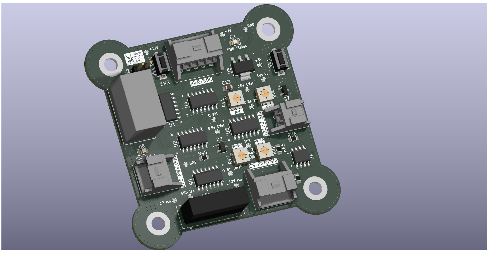
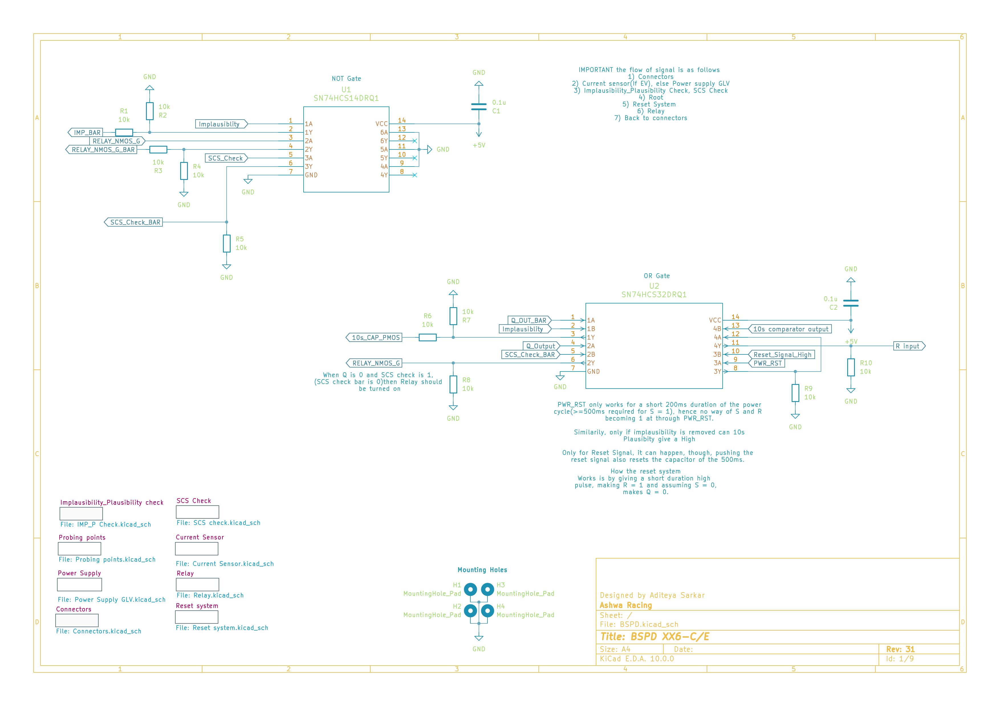
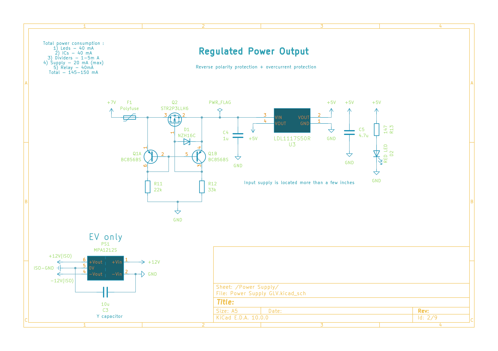
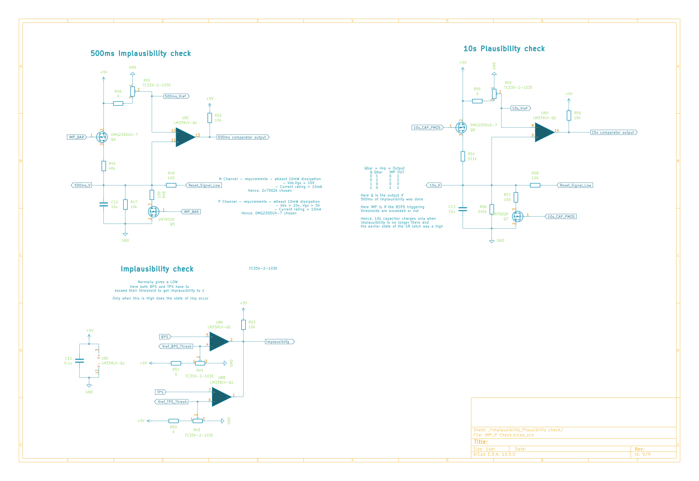
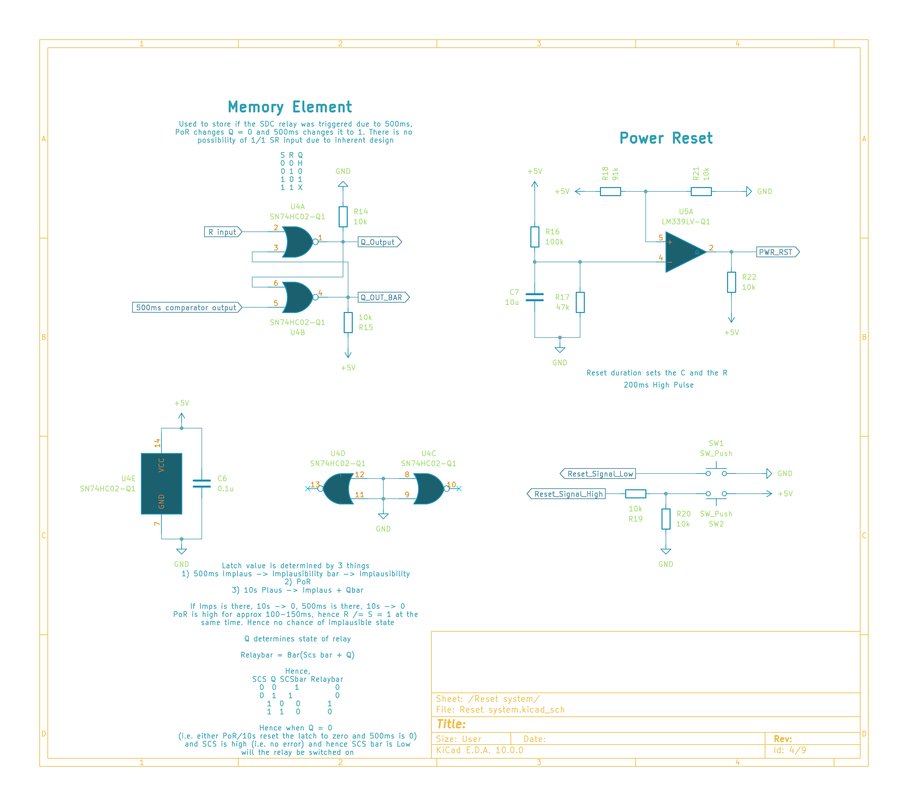
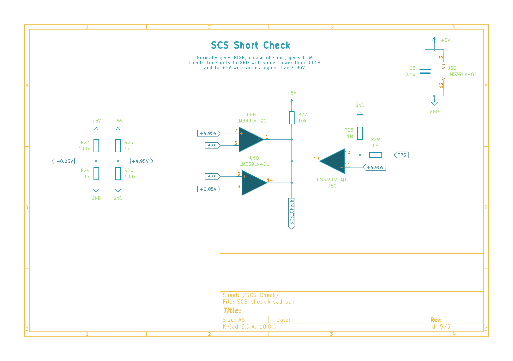
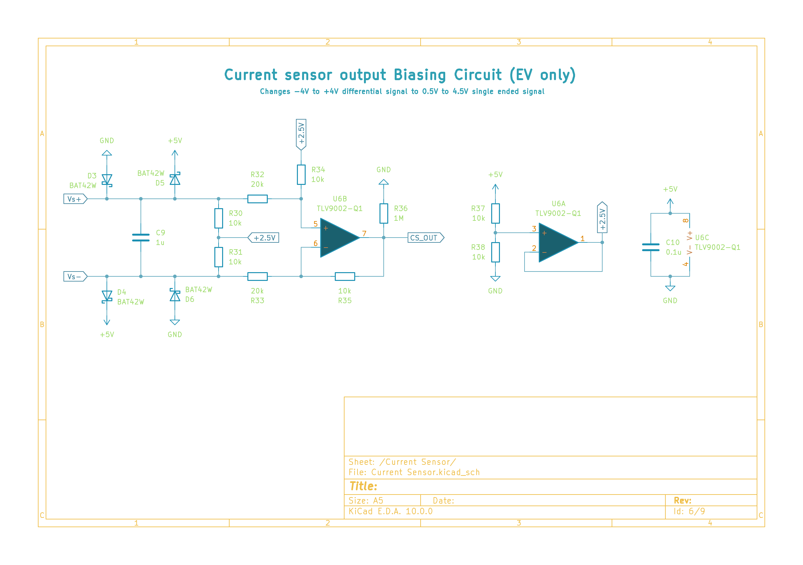
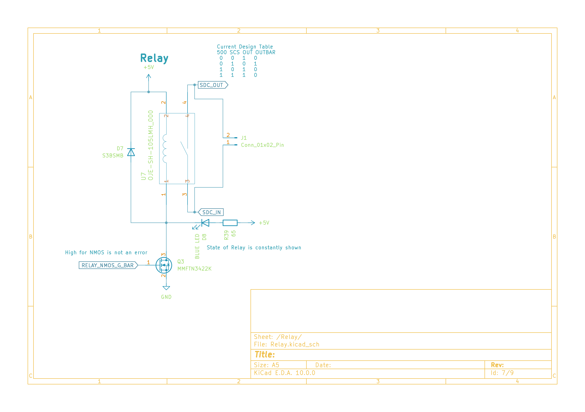

# BSPD RZ-XX6-C/E — Brake System Plausibility Device
**Ashwa Racing 27**  
Designed by Aditeya Sarkar

---



## What is a BSPD?

The Brake System Plausibility Device is a mandatory safety circuit in FSAE/Formula Student vehicles. Its job is to cut power to the motor (via the Shutdown Circuit / SDC) if the driver simultaneously applies heavy braking and demands significant throttle — a condition that should never happen during normal operation and indicates either a pedal fault or a stuck throttle.

This design targets the **FSG CV+EV rules** (with CV mode support via a jumper) and is built entirely out of discrete analog logic — no microcontroller involved.


---

## Block Diagram / Signal Flow

```
Connectors (BPS, TPS, SDC)
        │
        ▼
Current Sensor (EV only)          ←── Biasing circuit converts ±4V diff → 0.5–4.5V
        │
        ▼
Implausibility/Plausibility Check  ←── 500ms timer + 10s timer + comparators
        │
        ▼
SCS Check (Short Circuit Safety)
        │
        ▼
Reset System (SR latch + Power-on reset)
        │
        ▼
Relay (SDC_OUT → cuts motor power / fuel pump)
        │
        ▼
Back to Connectors
```

> Signal flow as annotated in the schematic (Sheet 1/9)

---

## Schematic Overview



The top-level sheet ties everything together. The core logic sits around a **SN74HCS14DRQ1** (Schmitt-trigger inverter, U1) and a **SN74HCS32DRQ1** (OR gate, U2), with the relay controlled by a NMOS gate driven off `RELAY_NMOS_G_BAR`.

---

## Subsystems

### 1. Power Supply



Input is +7V from the car's GLV (Grounded Low Voltage) supply. The board generates a regulated **+5V rail** using an **LDL1117S50R** LDO. Protection is handled by:

- **F1** — Polyfuse for overcurrent  
- **Q2 (STR2P3LLH6)** — P-channel MOSFET for reverse polarity protection, driven by a BC856BS transistor pair (Q1A/Q1B)
- **D1 (NZH16C)** — Zener clamp

For EV operation, isolated ±12V rails are generated via an **MPA1212S** DC-DC isolator (PS1), referenced to ISO-GND, with a Y-capacitor (C3, 10µF) for common-mode filtering.

Total board power budget: ~145–150mA (LEDs 40mA + ICs 40mA + dividers ~5mA + relay 40mA + misc).

---

### 2. Implausibility & Plausibility Check



This is the heart of the BSPD logic. Three comparator circuits run in parallel:

**Implausibility Check** (bottom-left, Sheet 9)  
- Uses **TC33X-2-103E** references and **LM339LV-Q1** comparators
- Both BPS (brake pressure) and TPS (throttle position) must exceed their respective thresholds simultaneously to flag implausibility
- Output: `Implausibility` signal (HIGH = fault)

**500ms Implausibility Timer** (top-left, Sheet 9)  
- Uses a **DMG2305UX-7** complementary MOSFET pair to charge/discharge a capacitor (C12, 10µF + C13) at a controlled rate
- When implausibility is sustained for >500ms, `500ms comparator output` goes HIGH
- The DWC2305UX-7 N-channel requirements: Vth ~1V, Ids up to 10mA → 2N7002K used
- The P-channel: Vth ~−1V, Ids ~10mA → same DWC2305UX-7 (check datasheet for exact variant)

**10s Plausibility Timer** (top-right, Sheet 9)  
- Similar RC-based timing circuit; capacitor (C13) only charges when implausibility is active
- Output: `10s comparator output` — used to latch the fault via the SR latch if the 10s window is exceeded
- `Reset_Signal_Low` can discharge the cap and reset state

---

### 3. Memory Element (SR Latch) + Power Reset



**SR Latch** (Sheet 4, left)  
Built from **SN74HC02-Q1** NOR gates (U4A/U4B):

| S (500ms) | R | Q |
|:---------:|:-:|:-:|
| 0 | 0 | Hold |
| 0 | 1 | 0 |
| 1 | 0 | 1 |

Q drives `Q_Output` and `Q_OUT_BAR`. The relay state is: `Relaybar = NOR(SCS_bar, Q)`.

So the SDC relay opens (cuts power) only when Q = 0 and SCS_bar is LOW — i.e., no fault and no short circuit detected.

**Power-on Reset** (Sheet 4, right)  
Uses an **LM339LV-Q1** comparator (U5A) with R16 (100k), R17 (47k), and C7 (10µF) to generate a ~200ms HIGH pulse on `PWR_RST` at power-on. This forces the latch into a known state (R = 1 momentarily → Q = 0). Once past the PoR window, R → 0 and normal latch operation resumes.

Two push-buttons (SW1, SW2) provide manual `Reset_Signal_High` / `Reset_Signal_Low` for bench testing.

---



### 4. SCS Short Circuit Check

The SCS (Short Circuit Safety) check uses **LM339LV-Q1** comparators (U5B/U5D/U5C) to detect wiring faults — specifically shorts to GND (<0.05V) or shorts to +5V (>4.95V) on the BPS and TPS lines.

- Normally: `SCS_Check` = HIGH (no fault)
- On short detection: goes LOW, which blocks the relay from closing regardless of Q

Thresholds set by 100k/1k voltage divider pairs on each input.

---



### 5. Current Sensor (HB0 300) Biasing (EV Only)

The current sensor (external, connected via J3) outputs a differential signal in the ±4V range. Sheet 6 handles the level shift to a 0.5V–4.5V single-ended signal suitable for the comparators.

- BAT42W Schottky diodes (D3–D6) clamp Vs+ and Vs− to the 0–5V range
- **TLV9002-Q1** op-amps (U6A/U6B) in a difference amplifier config with a +2.5V mid-rail reference
- Output: `CS_OUT` → fed into the implausibility comparator as the throttle-side signal in EV mode
- A jumper on Sheet 8 allows bypassing this for CV (combustion) mode, where TPS1_IN connects directly

---



### 6. Relay

The SDC relay is an **OJE-SH-105LMH** (U7), driven by an NMOS switch (**MMFTN3422K**, Q3) on the low side. `SDC_OUT` drives the relay coil. A **S3B5MB** diode (D7) provides flyback protection. A blue LED gives constant visual indication of relay state.

---

### 7. Connectors

All external signals come through **TE Connectivity 1744426-series** connectors:

| Connector | Signals |
|-----------|---------|
| J2 (1744426-5) | PWR_FLAG (+7V), GND, +12V, SDC_IN, SDC_OUT |
| J3 (1744426-4) | +12V(ISO), Vs−, Vs+, −12V(ISO) |
| J4 (1744426-3) | GND, BPS_IN, +12V |
| J5 (1744426-2) | TPS1_IN, GND |

BPS scaling: R42 (200Ω) + R43 (430Ω) divider sets `BPS_SCLD` in the 0.88V–4.4V window.  
ESD protection on BPS line via **ESDCAN01-2BLY** (D9).

---

### 8. Probing Points

16 dedicated test points for bench validation:

| TP | Net | TP | Net |
|----|-----|----|-----|
| TP1 | +12V | TP2 | Vref_BPS_Thresh |
| TP3 | +7V | TP4 | 500ms_Vref |
| TP5 | +5V | TP6 | 10s_Vref |
| TP7 | GND | TP8 | Vref_TPS_Thresh |
| TP9 | +12V ISO | TP10 | 10s_V |
| TP11 | GND ISO | TP12 | Q_Output |
| TP13 | −12V ISO | TP14 | 500ms_V |
| TP15 | BPS | TP16 | TPS |

---

## Key ICs

| Part | Function |
|------|----------|
| SN74HCS14DRQ1 | Schmitt-trigger inverter (signal conditioning) |
| SN74HCS32DRQ1 | OR gate (implausibility logic) |
| SN74HC02-Q1 | NOR gate SR latch (fault memory) |
| LM339LV-Q1 | Quad comparator (thresholds, SCS, power reset) |
| TLV9002-Q1 | Op-amp (current sensor biasing) |
| LDL1117S50R | 5V LDO regulator |
| MPA1212S | ±12V isolated DC-DC (EV) |
| OJE-SH-105LMH | SDC relay |
| MMFTN3422K | N-channel MOSFET (relay driver) |
| DMG2305UX-7 | Complementary MOSFET pair (timer charging) |

---

## KiCad Version Compatibility

This schematic was designed in **KiCad EDA 10.0.0**.

If you're on KiCad v9 and need to open these files, a downconverted v9-compatible version is available — reach out or raise an issue. The downconversion removes v10-specific fields (like `uuid` blocks and certain footprint attributes) that cause parse errors on older installs.

---

## Repo Structure

```
BSPD/
├── BSPD.kicad_sch              # Top-level schematic
├── Power Supply GLV.kicad_sch
├── Probing points.kicad_sch
├── Reset system.kicad_sch
├── SCS check.kicad_sch
├── Current Sensor.kicad_sch
├── Relay.kicad_sch
├── Connectors.kicad_sch
├── IMP_P_Check.kicad_sch       # Implausibility/Plausibility check
└── README.md
```

---

## Team

**Ashwa Racing — 27**  
R.V. College of Engineering, Bangalore  

Electrical & Testing Subsystem  
Schematic design: Aditeya Sarkar